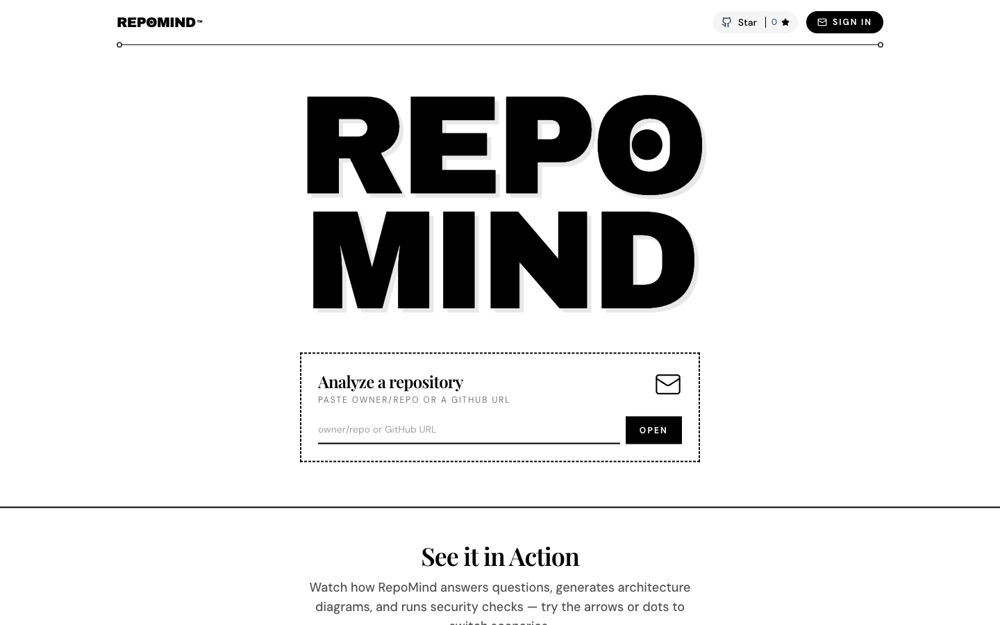
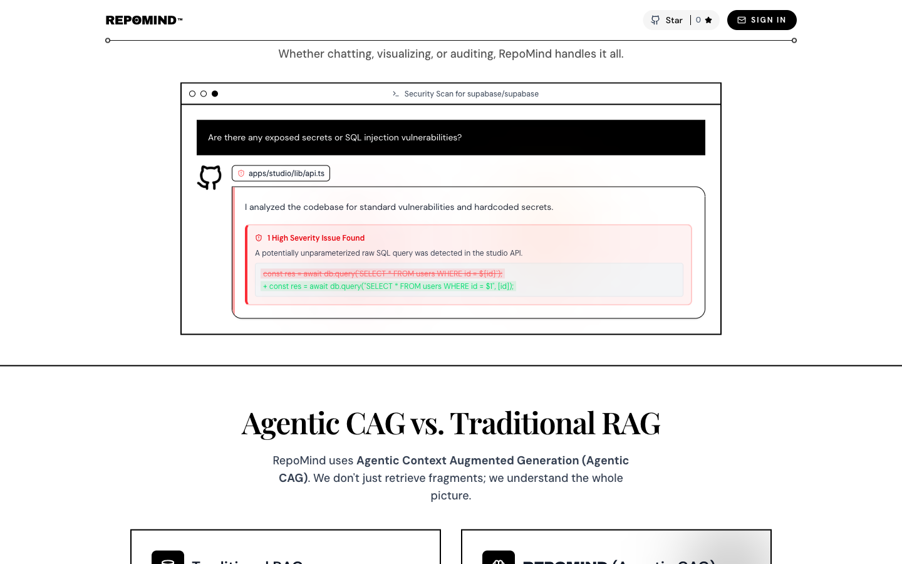
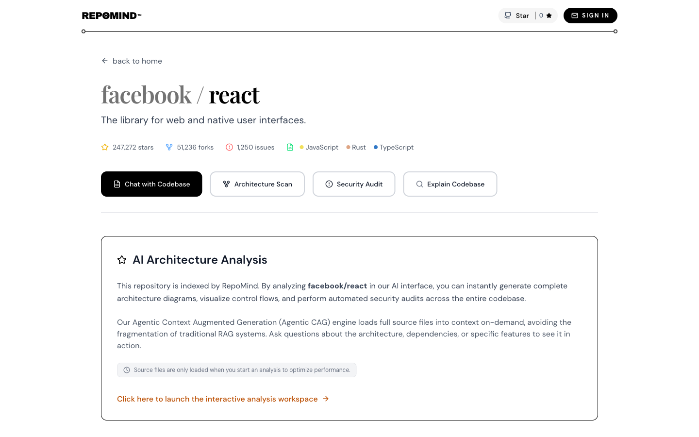
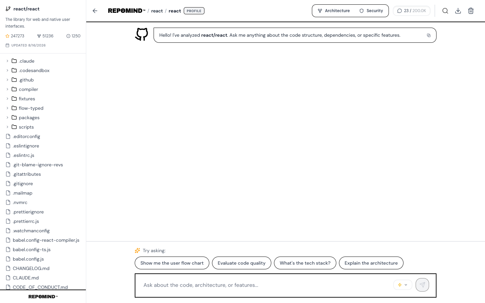
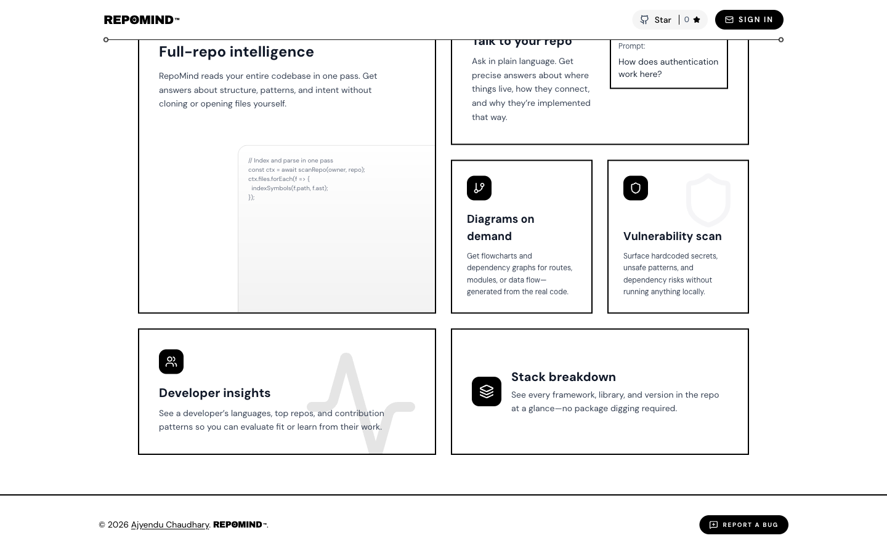
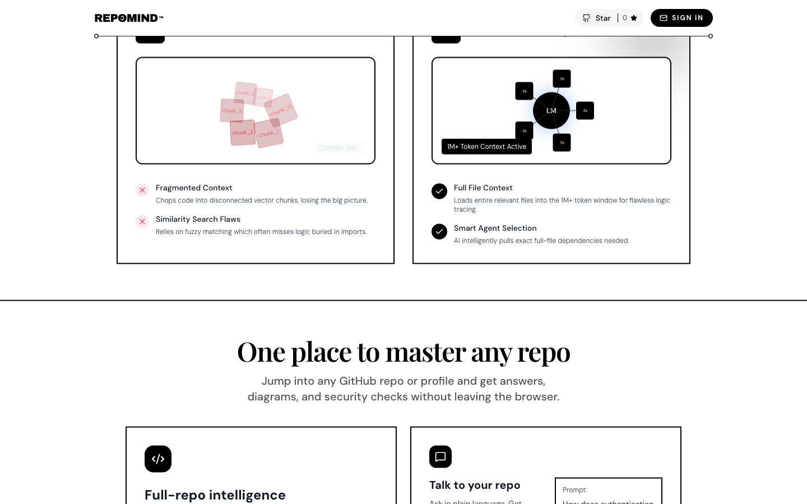
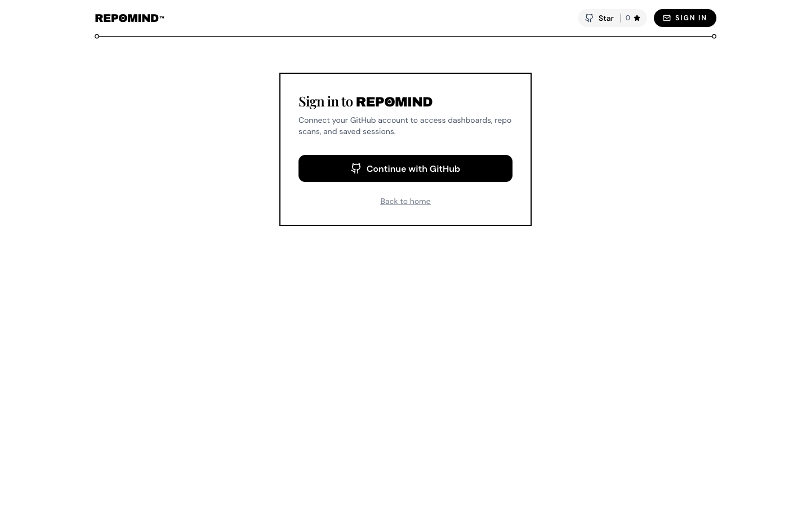
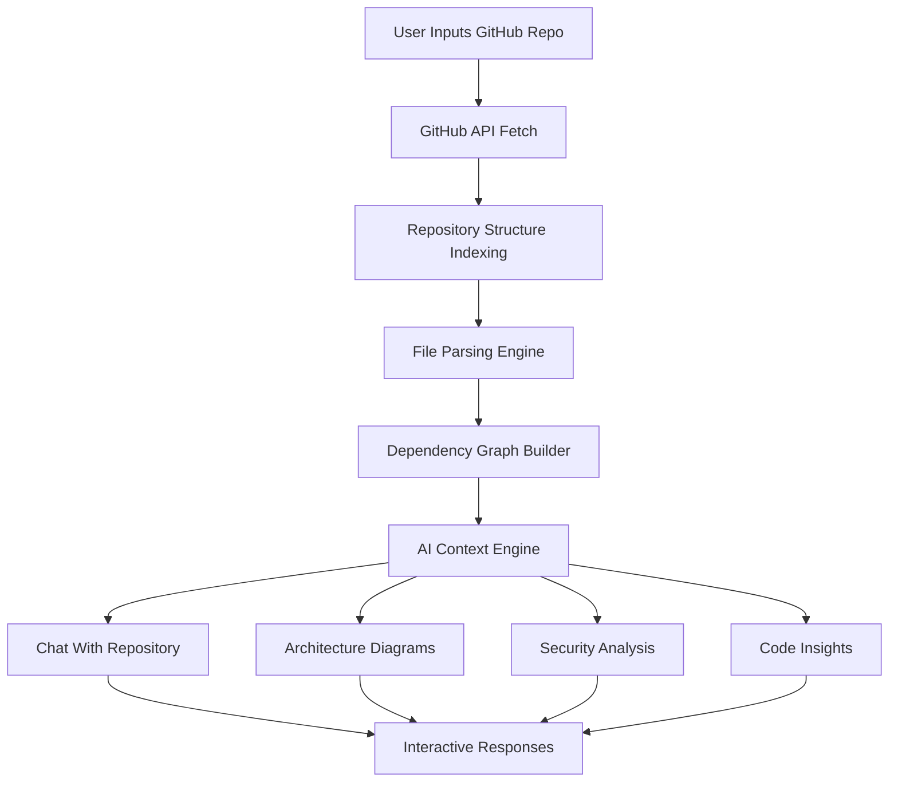
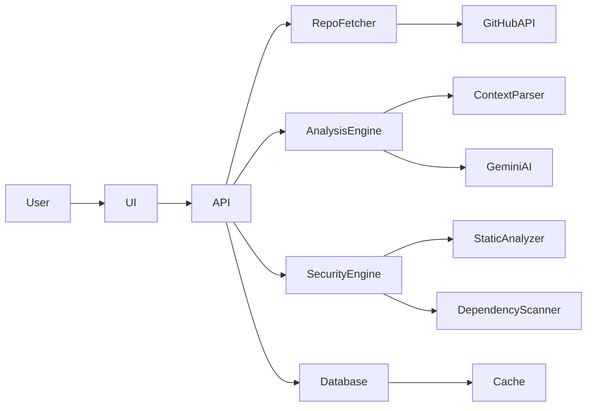

# ⚡ RepoMind

### Dive into Open Source. Master Any Repo. Instantly.

An **AI-powered platform for understanding GitHub repositories and developer profiles**.

Chat with any repository, generate architecture insights, and run security scans — **without cloning the repo**.

  


  
  


**Understand any GitHub repository in seconds.**


---


# 🚀 What is RepoMind?

RepoMind transforms any GitHub repository into an **interactive AI-powered knowledge system**.

Instead of manually reading hundreds of files, developers can:

- Ask questions about the codebase
- Generate architecture diagrams
- Identify security vulnerabilities
- Understand dependencies and project structure

All directly **inside the browser**.

RepoMind works without cloning repositories locally — it analyzes code using **GitHub APIs, full-file context reasoning, and AI models**.

---


# ✨ Core Features


| 🔍 Repo Intelligence             | 💬 Chat With Code         | 📊 Architecture Insights       |
| -------------------------------- | ------------------------- | ------------------------------ |
| Understand entire repo instantly | Ask questions about code  | Generate architecture diagrams |
| Full-file context analysis       | Locate logic across files | Visualize dependencies         |
| Detect patterns & structure      | Explain complex systems   | Flowcharts from real code      |


  


| 🛡 Security Scanning      | 👨‍💻 Developer Insights   | ⚡ Instant Repo Analysis |
| ------------------------- | -------------------------- | ----------------------- |
| Detect vulnerabilities    | Analyze developer profiles | No cloning required     |
| Find hardcoded secrets    | View contribution patterns | Works via GitHub APIs   |
| Dependency risk detection | Explore top repositories   | Instant analysis        |


---


# 📸 Application Gallery

Screenshots captured from the live app.

<div align="center">

<table>
<tr>
<td align="center" width="50%">
<br/>
<sub><b>Home</b> — paste a GitHub URL and open the repo</sub>
</td>
<td align="center" width="50%">
<br/>
<sub><b>Demo</b> — chat, architecture, and security walkthrough</sub>
</td>
</tr>
<tr>
<td align="center">
<br/>
<sub><b>Repo profile</b> — stats, README, and analysis actions</sub>
</td>
<td align="center">
<br/>
<sub><b>Chat</b> — ask questions against the full codebase</sub>
</td>
</tr>
<tr>
<td align="center">
<br/>
<sub><b>Features</b> — intelligence, diagrams, scans, and profiles</sub>
</td>
<td align="center">
<br/>
<sub><b>Agentic CAG</b> — full-file context vs traditional RAG</sub>
</td>
</tr>
<tr>
<td align="center" colspan="2">
<br/>
<sub><b>Sign in</b> — GitHub login for dashboards and saved scans</sub>
</td>
</tr>
</table>

</div>


---


# 🧠 Repository Intelligence Pipeline




### Explanation

The analysis pipeline works in multiple stages:

**1. Repository Fetch**

RepoMind fetches repository files and metadata through the GitHub API.

**2. File Indexing**

All files are indexed and organized into a structure graph.

**3. Context Parsing**

Instead of chunking files like RAG systems, RepoMind reads **full files**, preserving context.

**4. Dependency Graph Creation**

Imports and module relationships are analyzed to understand system architecture.

**5. AI Processing**

Gemini models reason about:

- repository architecture
- code patterns
- security vulnerabilities
- dependency flows

**6. Insight Generation**

Results are converted into:

- chat answers
- diagrams
- vulnerability reports
- repo summaries

---


# 🏗 System Architecture




### Explanation

**Frontend (Next.js)**

Handles:

- UI interactions
- repo chat interface
- architecture visualization
- security reports

---

**API Layer**

Acts as the orchestration layer responsible for:

- repo fetching
- triggering AI analysis
- security scanning
- caching results

---

**Analysis Engine**

Processes repository code and generates insights using AI.

---

**Security Engine**

Runs static analysis to detect vulnerabilities and insecure patterns.

---

**Database & Cache**

Prisma stores structured data while caching layers reduce repeated analysis time.

---


# ⚙️ Getting Started


### Prerequisites

- Node.js **18+**
- GitHub Token
- Gemini API Key

---


### Installation

```bash
git clone https://github.com/Ajyendu/RepoMind.git

cd RepoMind

npm install
```

---


### Environment Setup

Create `.env.local`

```
GITHUB_TOKEN=
GEMINI_API_KEY=
DATABASE_URL=
```

---


### Start Development Server

```bash
npm run dev
```

Open:

```
http://localhost:3000
```

---


### Docker

Build and run the app with Docker Compose:

```bash
cp .env.example .env.local
# edit .env.local with required secrets

docker compose up --build
```

The app will be available at:

```bash
http://localhost:3000
```

The Compose stack includes:

- `db` — PostgreSQL 16
- `redis` — Redis 7
- `app` — Next.js Docker container

If you want a standalone image instead of Compose:

```bash
docker build -t gitpulse .

docker run -p 3000:3000 \
  --env-file .env.local \
  --env DATABASE_URL=postgres://gitpulse:gitpulse@db:5432/gitpulse \
  --env DIRECT_URL=postgres://gitpulse:gitpulse@db:5432/gitpulse \
  gitpulse
```

---


# 🔮 Roadmap

Future improvements planned for RepoMind:

- repository dependency graphs
- pull request intelligence
- multi-repo analysis
- deeper vulnerability scanning
- contributor insights

---


# 👨‍💻 Author

**[Ajyendu Chaudhary](https://github.com/Ajyendu)**

⭐ If you like the project, consider giving it a star!

