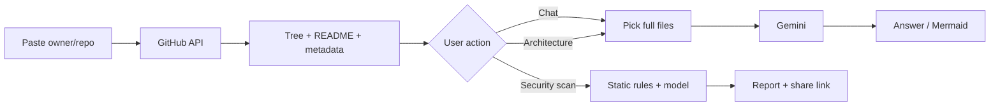

# RepoMind

**Ask a GitHub repository questions. Get architecture diagrams and security findings. You never clone the repo.**

RepoMind is a Next.js app that turns `owner/repo` (or a GitHub URL) into an interactive workspace: chat, file tree, Mermaid diagrams, and static security scans. Code is fetched through the GitHub API. Gemini reasons over **full files**, not tiny vector chunks.

Live local app: [http://localhost:3000](http://localhost:3000) after `npm run dev`.  
Source: [github.com/Ajyendu/RepoMind](https://github.com/Ajyendu/RepoMind)

<p align="center">
  
</p>

---

## Why it exists

Reading an unfamiliar codebase usually means cloning it, searching blindly, and piecing together imports by hand. RepoMind is for the first hour of that work:

1. Paste `facebook/react` or `https://github.com/facebook/react`.
2. Open the **repo profile** (stars, languages, full README).
3. Start **chat** to ask “where is auth?”, “what is the stack?”, “draw the request flow”.
4. Run **architecture** or **security** from the same workspace.
5. Sign in with GitHub if you want dashboards, saved scans, and private repos.

Public metadata and READMEs load without an account. Chat against source files requires GitHub sign-in.

---

## What you can do

| You want | What RepoMind does |
| --- | --- |
| Understand a repo fast | Indexes structure from GitHub, then answers in chat with file-level context |
| See how it is built | Generates Mermaid flowcharts from the real tree and imports, not a generic template |
| Check for obvious risk | Static scan for secrets, unsafe patterns, and dependency hints |
| Study a developer | Profile mode: languages, repos, contribution shape |
| Share a finding | Scan reports with share links and expiry |

It does **not** run the project, apply patches, or replace a full SAST/CI pipeline. Treat scan results as a starting point.

---

## Product tour

<p align="center">
  
  &nbsp;
  
</p>

<p align="center">
  <sub>Repo profile → chat workspace (file tree, prompts, architecture / security)</sub>
</p>

<p align="center">
  
  &nbsp;
  
</p>

<p align="center">
  <sub>Homepage demo · why full-file context (CAG) is used instead of RAG chunks</sub>
</p>

<p align="center">
  
  &nbsp;
  
</p>

---

## How analysis works

Traditional RAG splits files into embeddings and retrieves fragments. That often drops the import that actually matters.

RepoMind uses **agentic CAG** (context-augmented generation):

1. **Fetch** repo metadata, languages, commits, and README via GitHub REST/GraphQL.
2. **Index** the file tree (noisy paths are hidden from the sidebar).
3. **Select** relevant **whole files** for the question (not 200-token slices).
4. **Reason** with Gemini (`gemini-3.5-flash` by default; optional thinking model).
5. **Return** chat, diagrams, or a structured security report.



Source files are loaded when you start analysis, not when you only view the profile page.

---

## Stack

| Layer | Choice |
| --- | --- |
| UI | Next.js (App Router), TypeScript, Tailwind |
| Auth | NextAuth / Auth.js + GitHub OAuth |
| Data | Prisma + PostgreSQL (Neon locally is fine) |
| Cache | Redis (optional); Vercel KV env vars if you use them |
| GitHub | Octokit + `GITHUB_TOKEN` |
| Model | Google Gemini |
| Deploy | Vercel-ready (`npm run build:vercel`) |

---

## Run locally

**Need:** Node 18+, a GitHub token, a Gemini API key, and a Postgres URL.

```bash
git clone https://github.com/Ajyendu/RepoMind.git
cd RepoMind
npm install
cp .env.example .env.local
```

Fill at least:

```bash
GITHUB_TOKEN=
GEMINI_API_KEY=
GEMINI_MODEL=gemini-3.5-flash
DATABASE_URL=           # Postgres
DIRECT_URL=             # same DB; add ?sslmode=require for Neon
AUTH_SECRET=            # random string
AUTH_GITHUB_ID=         # GitHub OAuth App client ID
AUTH_GITHUB_SECRET=
APP_URL=http://localhost:3000
AUTH_URL=http://localhost:3000
NEXTAUTH_URL=http://localhost:3000
NEXT_PUBLIC_APP_URL=http://localhost:3000
```

GitHub OAuth callback:

`http://localhost:3000/api/auth/callback/github`

```bash
npx prisma migrate deploy   # or prisma migrate dev
npm run dev
```

Open [http://localhost:3000](http://localhost:3000).

Do not commit `.env.local`. Copy placeholders from `.env.example` only.

### Docker

```bash
cp .env.example .env.local
# set tokens in .env.local
docker compose up --build
```

Compose starts Postgres 16 (`localhost:5433`), Redis 7, and the app on port 3000. Compose still uses the `gitpulse` database user from `docker-compose.yml`.

---

## Project map

| Path | Role |
| --- | --- |
| `src/app/chat` | Repo / profile chat UI |
| `src/app/repo/[owner]/[repo]` | Public repo profile + README |
| `src/app/report` | Security report + shared links |
| `src/app/dashboard` | Signed-in scans and repos |
| `src/lib/github.ts` | GitHub fetch + context |
| `src/lib/gemini.ts` | Model calls |
| `src/lib/security-scanner.ts` | Static findings |
| `prisma/schema.prisma` | Users, chats, scans |

```bash
npm test
```

---

## Roadmap

- Richer dependency graphs
- Pull-request scoped analysis
- Multi-repo questions
- Stronger verification of scan findings

---

## License

[MIT](LICENSE) © [Ajyendu Chaudhary](https://github.com/Ajyendu)

If this saves you a clone-and-grep session, star the repo.
